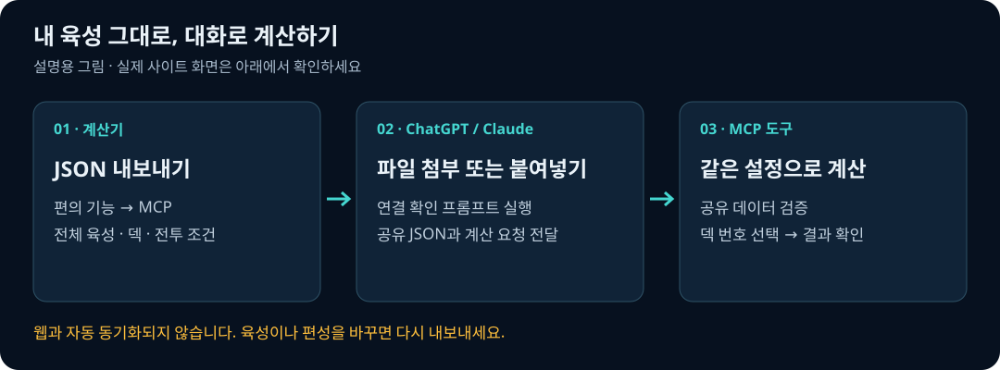
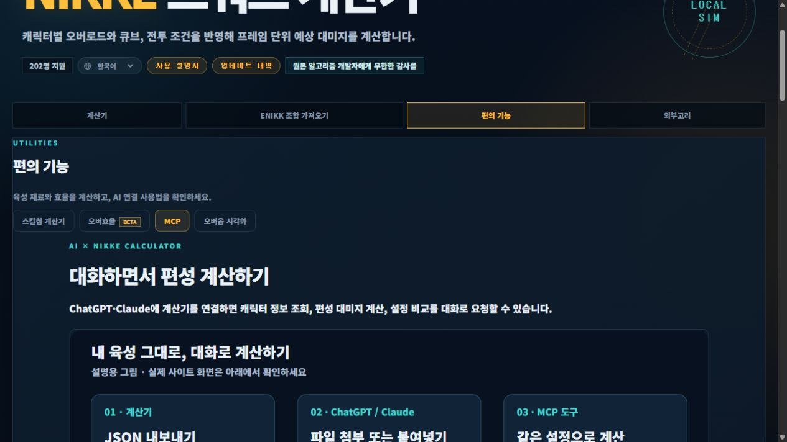
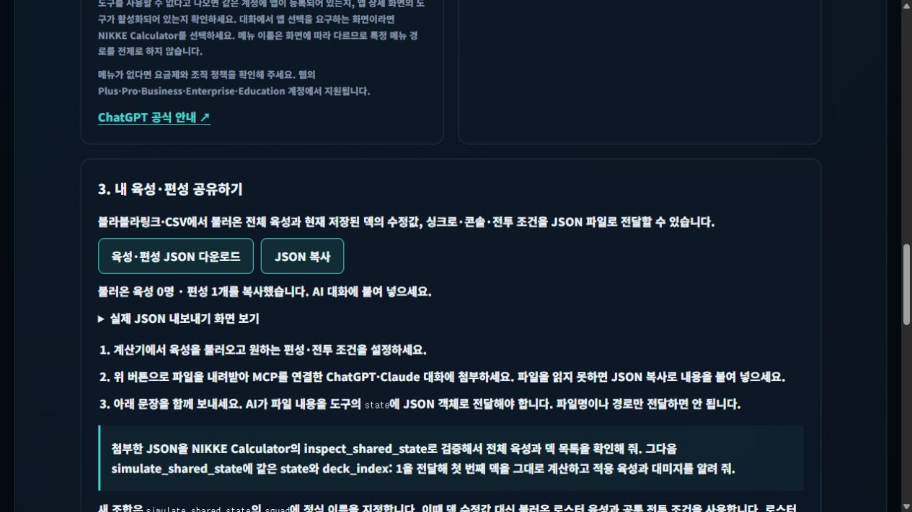

# AI에서 니케 계산기 사용하기

ChatGPT·Claude·MCP 지원 에이전트가 **기존 웹 계산기와 같은 Python 엔진**을 호출합니다.
이 서버에는 AI 모델이나 AI API 키가 필요하지 않습니다. 사용하는 AI 서비스의 이용 조건은 별도입니다.

**바로 연결할 무료 체험 MCP 주소:** `https://nikke-calc-mcp.onrender.com/mcp`

[서버 상태 확인](https://nikke-calc-mcp.onrender.com/health)에서 `status: ok`를 확인한 뒤,
ChatGPT는 **6절**, Claude 웹은 **7절**을 따라 위 주소를 등록하면 됩니다. 인증 방식은 **No Authentication**입니다.
무료 Render 인스턴스라 절전 후 첫 응답이 늦을 수 있고, 동시 계산은 1개입니다.
GitHub Pages 사이트 주소는 MCP 주소가 아닙니다.

직접 운영하려는 사용자를 위한 로컬 실행 프로그램, 자동 설치 스크립트, 원격 Docker 배포 구성도 제공합니다.

## 1. 연결 방식 고르기

| 사용 환경 | 연결 방식 | 서버 필요 여부 |
|---|---|---|
| Claude Desktop의 로컬 MCP, 로컬 MCP 지원 에이전트 | stdio | 이 PC가 계산 실행 |
| ChatGPT 웹, Claude 웹의 사용자 지정 커넥터 | 원격 Streamable HTTP | 외부에서 접근 가능한 HTTPS 실행 환경 필요 |
| 개발 중 HTTP 점검 | `http://127.0.0.1:8000/mcp` | PC에서만 접속 |

제공된 무료 체험 주소를 사용한다면 서버 설치는 건너뛰어도 됩니다.
ChatGPT에 `localhost`를 입력하는 것만으로 PC에 연결되지 않습니다.
Claude도 **원격 커넥터는 클라우드에서 접속**합니다. Claude Desktop의 로컬 MCP 설정은 다른 방식입니다.
직접 PC에서 실행하려면 **2~3절**, 서버 배포는 **5절**, 제공된 주소로 원격 연결하려면 **6~7절**을 따르세요.

## 2. Windows 설치

Python 3.10 이상과 Git이 필요합니다. PowerShell에서 실행합니다.
이미 저장소가 있으면 clone을 반복하지 말고 기존 저장소 폴더로 이동하세요.

```powershell
git clone https://github.com/Moris-kr/nikke-calc.git
cd nikke-calc
powershell -ExecutionPolicy Bypass -File .\nikke_mcp\setup.ps1
```

`Bypass`는 위 설치 프로세스에만 적용되며 시스템 실행 정책은 바꾸지 않습니다.
`python` 명령이 없다면 설치된 Python의 경로를 지정할 수 있습니다.

```powershell
.\nikke_mcp\setup.ps1 -Python 'C:\Python312\python.exe'
```

설치기는 저장소 안에 `.venv-mcp` 가상환경을 만들고, 필요한 라이브러리와
**이 PC의 경로가 들어간 Claude 설정 예제**를 생성합니다. 기존 앱 설정은 수정하지 않습니다.
마지막에 `"status": "OK"`와 아래 도구 이름이 나오면 실제 연결·계산 검증까지 성공한 것입니다.

```text
list_characters · get_character · get_settings · simulate_squad · compare_setups
inspect_shared_state · simulate_shared_state
```

직접 다시 확인하려면:

```powershell
.\.venv-mcp\Scripts\python.exe .\nikke_mcp\smoke.py
```

macOS/Linux에서는 같은 저장소에서 다음 명령을 사용합니다.

```bash
python3 -m venv .venv-mcp
.venv-mcp/bin/python -m pip install -r nikke_mcp/requirements.txt
.venv-mcp/bin/python nikke_mcp/smoke.py
```

## 3. Claude Desktop / 로컬 에이전트 연결

Claude Desktop의 설정에서 개발자(Developer) → 설정 편집(Edit Config)을 엽니다.
메뉴 이름은 앱 버전에 따라 다를 수 있습니다. 로컬 MCP 설정 파일은
Windows의 `%APPDATA%\Claude\claude_desktop_config.json`입니다.

설치기가 만든 `.venv-mcp/claude-desktop-config.json` 내용을 확인한 뒤,
기존 파일의 `mcpServers` 안에 **`nikke-calc` 항목만 병합**합니다. 다른 서버 설정을 덮어쓰지 마세요.
아래 경로는 예시이며 실제 설치 위치로 바꿔야 합니다.

```json
{
  "mcpServers": {
    "nikke-calc": {
      "command": "C:/nikke-calc/repo/.venv-mcp/Scripts/python.exe",
      "args": ["C:/nikke-calc/repo/nikke_mcp/launch.py"]
    }
  }
}
```

macOS/Linux는 `command`에 `/설치경로/.venv-mcp/bin/python`,
`args`에는 `/설치경로/nikke_mcp/launch.py`의 절대 경로를 넣습니다.
다른 로컬 MCP 지원 에이전트도 이 **실행 파일 + 인자**를 해당 제품의 서버 설정에 등록하면 됩니다.

Claude Desktop을 완전히 종료하고 다시 실행한 뒤, 새 대화에서 도구가 표시되는지 확인하세요.
로컬 stdio 서버는 앱이 필요할 때 실행하므로 별도 터미널을 계속 켜둘 필요가 없습니다.
PC가 꺼지면 사용할 수 없습니다.

첫 대화 예시:

> 니케 계산기 도구를 사용해서 등록된 캐릭터 중 리타를 찾아줘.
> 스킬 레벨 10 원문도 보여줘. 수치를 추측하지 말고 도구 결과를 사용해줘.

조회 도구가 실제로 호출되면 연결된 것입니다. 모델이 설명만 한다면 도구 활성화 여부를 확인하세요.

## 4. 내 PC에서 HTTP 테스트

PowerShell 창 하나에서 서버를 켭니다.

```powershell
.\.venv-mcp\Scripts\python.exe -m nikke_mcp --transport streamable-http
```

다른 창에서 확인합니다.

```powershell
Invoke-RestMethod http://127.0.0.1:8000/health
.\.venv-mcp\Scripts\python.exe .\nikke_mcp\smoke.py --url http://127.0.0.1:8000/mcp
```

`/health`는 상태 확인, **`/mcp`가 AI 연결 주소**입니다.
브라우저로 `/mcp`를 여는 것은 연결 검증이 아닙니다. MCP 클라이언트가 프로토콜에 맞게 호출해야 합니다.
서버 종료는 서버 창에서 `Ctrl+C`입니다.

## 5. 원격 서버 배포 준비

### Render 무료 플랜으로 시작하기

[Render에 배포하기](https://render.com/deploy?repo=https://github.com/Moris-kr/nikke-calc)

1. Render에 로그인하고 위 링크로 Blueprint 생성 화면을 엽니다.
2. 저장소와 `master` 브랜치, `render.yaml`을 확인합니다.
3. 생성할 리소스가 **nikke-calc-mcp 웹 서비스 1개**, 플랜이 **Free / $0**인지 확인한 뒤 배포합니다.
   데이터베이스·디스크·유료 플랜은 추가하지 않습니다. 결제를 요구하면 진행하지 말고 Free 선택을 다시 확인하세요.
4. 서비스가 `Live`가 되면 Render가 실제로 발급한 `https://…onrender.com` 주소를 복사합니다.
   서비스 이름과 URL이 반드시 같지는 않으므로 이름으로 주소를 추측하지 마세요.
5. 주소 끝에 `/health`를 붙여 `status: ok`를 확인합니다. AI 연결에는 `/mcp`를 붙입니다.
6. 로컬 검증 클라이언트로 아래 명령을 실행한 뒤 ChatGPT/Claude에 등록합니다.

```powershell
.\.venv-mcp\Scripts\python.exe .\nikke_mcp\smoke.py --url https://실제발급주소.onrender.com/mcp
```

Render 전용 설정은 동시 계산 **1개**, 한 건 제한 **120초**로 무료 인스턴스의 메모리와 CPU에 맞춥니다.
발급된 호스트 이름은 Render 환경 변수에서 자동으로 허용하므로 수동 입력할 필요가 없습니다.
GitHub 검사 통과 후 자동 배포되도록 구성했습니다.

무료 서비스는 **15분간 요청이 없으면 절전**되고 다시 켜지는 데 약 1분이 걸릴 수 있습니다.
오래 쉬었다면 `/health`를 먼저 열어 정상 응답을 기다린 뒤 AI 연결을 재시도하세요.
처음에는 10~30초 전투로 확인하고, 180초와 여러 후보 비교는 실제 처리 시간을 확인하며 사용하세요.
자동 깨우기용 주기적 호출은 설정하지 않습니다.
월 무료 실행 시간은 워크스페이스 안에서 공유되며 네트워크·빌드 한도도 적용됩니다.
공식 안내: [Render 무료 정책](https://render.com/docs/free).

### 직접 Docker 서버에 배포하기

Docker를 실행할 서버와 HTTPS 도메인을 준비한 뒤 사용합니다.
이 저장소의 GitHub Pages 배포는 MCP 서버를 시작하지 않습니다.
아래 `mcp.example.com`은 설명용 예시이며 제공되는 서비스가 아닙니다.

저장소 최상위에서 이미지를 빌드합니다.

```bash
docker build -f nikke_mcp/Dockerfile -t nikke-mcp .
docker run -d --name nikke-mcp --restart unless-stopped \
  --memory=1g --cpus=2 \
  -p 127.0.0.1:8000:8000 \
  -e NIKKE_MCP_ALLOWED_HOSTS=mcp.example.com \
  nikke-mcp
```

줄 끝 `\`는 Linux 셸 문법입니다. PowerShell에서는 명령을 한 줄로 입력하세요.
서버의 HTTPS 역방향 프록시 또는 호스팅 플랫폼에서 다음을 설정합니다.

| 항목 | 값 |
|---|---|
| 외부 주소 | `https://mcp.example.com` |
| 전달 대상 | 같은 서버의 `http://127.0.0.1:8000` |
| 경로 | `/mcp`와 `/health`를 그대로 전달 |
| Host 헤더 | `mcp.example.com` 유지 |
| 연결 시간 제한 | 비교 5개가 순차 실행될 수 있으므로 330초 이상 권장 |
| 공개 주소 검증 | `https://mcp.example.com/health`와 smoke 클라이언트 |

서버가 아닌 호스팅 플랫폼의 컨테이너로 실행한다면 해당 플랫폼에서
컨테이너 포트 `8000`으로 라우팅하고 HTTPS를 설정합니다.
도메인을 변경하면 환경 변수의 허용 도메인도 바꿔 재시작해야 합니다.
쉼표로 여러 도메인을 지정할 수 있습니다. 스킴과 `/mcp`는 환경 변수에 넣지 않습니다.

```bash
python nikke_mcp/smoke.py --url https://mcp.example.com/mcp
```

검증 클라이언트에도 `nikke_mcp/requirements.txt` 설치가 필요합니다.
클라이언트의 도구 호출 시간 제한이 더 짧으면 후보 수나 전투 시간을 줄이세요.

**이 버전은 인증 없는 공개 계산 도구입니다.** 사용자 계정·프로필 보관·결과 목록 API는 없습니다.
주소를 아는 사람은 계산을 요청할 수 있으므로 운영 환경에는 요청 빈도 제한을 추가하세요.
OAuth나 사용자별 저장 기능은 이 구성에 포함되지 않습니다.
기본 프로세스당 동시 계산은 2개, 대기 제한은 2초, 계산 한 건 제한은 60초입니다.

컨테이너에는 필요한 엔진·공개 게임 데이터만 복사합니다.
`profiles/`, 세션 쿠키, `.git`, 로컬 환경 파일, 브라우저 데이터는 빌드 대상에서 제외합니다.
개인 계정 폴더를 컨테이너에 마운트할 필요가 없습니다.

## 6. ChatGPT 웹 연결

**상단 무료 체험 주소 또는 5절에서 직접 배포한 HTTPS 주소를 사용합니다.** 로컬 설치만으로 이 단계는 완료되지 않습니다.
현재 공식 문서의 개발자 모드 경로는 다음과 같습니다. 계정·조직 정책에 따라 메뉴와 권한이 다를 수 있습니다.

1. ChatGPT 웹의 설정 → 보안 및 로그인(Security and login)에서 개발자 모드를 켭니다.
2. [ChatGPT Plugins](https://chatgpt.com/plugins)에서 `+`를 눌러 개발자 모드 앱을 만듭니다.
3. 이름은 `NIKKE Calculator`, MCP 주소는 **`https://nikke-calc-mcp.onrender.com/mcp`** 또는 직접 배포한 주소를 입력합니다.
4. 이 버전의 인증 방식은 **No Authentication**입니다. OpenAI API 키나 블라블라링크 쿠키를 입력하지 않습니다.
5. 앱 상세 화면에서 도구 목록을 확인합니다. 서버 업데이트 후에는 Refresh로 갱신합니다.
6. 새 대화에 다음 확인 프롬프트를 보냅니다. 실제 도구 호출과 목록이 보이면 연결된 것입니다.

> NIKKE Calculator의 list_characters 도구를 호출해 사용 가능한 캐릭터 3명의 이름을 보여줘. 도구를 호출할 수 없으면 추측하지 말고 연결되지 않았다고 알려줘.

도구를 사용할 수 없다고 나오면 등록 계정과 도구 활성화를 확인하세요. 대화에서 앱 선택을 요구하는 화면이면 NIKKE Calculator를 선택합니다. 선택 메뉴는 화면마다 다를 수 있어 `+ → 개발자 모드`를 필수 경로로 안내하지 않습니다.

메뉴가 없으면 계정의 개발자 모드 제공 여부와 조직 관리자의 앱 허용 설정을 확인하세요.
일반 대화에 주소만 붙이는 것으로 MCP가 등록되지는 않습니다.

공식 기준: [OpenAI ChatGPT Developer mode](https://developers.openai.com/api/docs/guides/developer-mode).
이 절은 공식 문서를 바탕으로 작성했으며, 사용자 계정에서 실제 연결한 화면을 뜻하지 않습니다.

## 7. Claude 웹 / 원격 커넥터 연결

1. Claude의 Customize → Connectors에서 사용자 지정 커넥터를 추가합니다.
2. 이름과 **`https://nikke-calc-mcp.onrender.com/mcp`** 또는 직접 배포한 주소를 입력합니다.
3. 이 서버에는 OAuth가 없으므로 고급 OAuth Client ID/Secret을 입력하지 않습니다.
4. 새 대화의 `+` → Connectors에서 연결한 도구를 활성화하고 조회 예시를 실행합니다.

Team/Enterprise는 조직 관리자가 먼저 추가해야 할 수 있습니다.
원격 커넥터는 Claude 서버에서 접속하므로 PC나 사내망에서만 열리는 주소로는 연결되지 않습니다.
공식 기준: [Claude 사용자 지정 원격 MCP](https://support.claude.com/en/articles/11175166-get-started-with-custom-connectors-using-remote-mcp).

## 8. 계산·비교 예제

아래는 **기본 스펙을 사용하는 가상 예제**입니다. 개인 계정 정보가 아닙니다.

> 니케 계산기로 리타, 크라운, 신데렐라, 모더니아, 나가를 180초 계산해줘.
> 보스 방어력 31784, 속성 없음, 코어 크기 0, 파츠 없음, 기대값 모드로 해줘.
> 육성은 계산기 기본값을 쓰고, 적용된 기본 스펙과 기본값에서 달라진 항목도 알려줘.

`simulate_squad`의 도구 인자 예시:

```json
{
  "request": {
    "squad": ["리타", "크라운", "신데렐라", "모더니아", "나가"],
    "duration": 180,
    "enemyDef": 31784,
    "enemyCode": "",
    "corePx": 0,
    "hasParts": false,
    "rngMode": "expected",
    "seed": 42,
    "characters": {}
  }
}
```

> 같은 조건에서 신데렐라의 큐브만 미착용으로 바꾼 후보와 원래 후보를 비교해줘.
> 실제 compare_setups 결과로 총딜 차이와 비율을 알려줘.

AI는 1번 후보를 유지하고, 2번 후보의 `characters`에 다음을 지정합니다.

```json
{"신데렐라": {"cube": {"name": "없음", "level": 0}}}
```

`compare_setups`의 인자는 `{"requests": [첫번째_요청객체, 두번째_요청객체]}` 구조입니다.
앞 예제에서 `request` 안에 들어가는 객체 두 개를 사용하며, 위 표기는 구조 설명입니다.
후보마다 전투 조건이 다르면 서버가 비교를 거부합니다.

스킬 레벨을 반영하려면 해당 캐릭터 설정에 다음을 넣습니다.

```json
{"skillLevels": {"1": 7, "2": 7, "3": 10}}
```

지원하는 육성 입력은 `get_settings`로 확인합니다. 싱크로·콘솔·보스 페이즈·버스트 순서를 지원합니다.
실제 육성을 전달하려면 아래 MCP 전용 JSON을 사용합니다. 일반 백업 JSON과 커스텀 캐릭터·핵 옵션은 지원하지 않습니다.
미지원 옵션을 보내면 무시하지 않고 오류로 처리합니다.

### 웹의 전체 육성·편성을 공유하기





1. 계산기에서 블라블라링크/CSV 육성을 불러오고 편성·전투 조건을 설정합니다.
2. **편의 기능 → MCP → 육성·편성 JSON 다운로드**를 누릅니다. JSON 복사도 가능합니다.
3. `nikke-calc-mcp.json`을 연결한 AI 대화에 첨부하고 아래 요청을 보냅니다. 파일 읽기가 안 되면 JSON 내용을 붙여 넣습니다.



> 첨부한 JSON을 inspect_shared_state의 state에 전달해 전체 육성과 덱 목록을 확인해줘. 이어 simulate_shared_state에 같은 state와 deck_index: 1을 전달해 첫 덱을 그대로 계산해줘. 실제 적용한 육성도 알려줘.

`state`에는 파일 경로나 URL이 아니라 **파싱한 JSON 객체 전체**를 전달합니다. 서버가 파일을 내려받거나 보관하지 않으므로 호출마다 같은 객체를 전달해야 합니다. 새 조합은 `simulate_shared_state`의 `squad`에 정식 이름 목록을 지정합니다. 이때는 `roster` 육성과 공통 `battle` 조건을 사용하며, 로스터에 없는 캐릭터는 기본값으로 대체하지 않고 거절합니다. 덱 수정값을 유지하려면 `deck_index`를 사용하세요. 인덱스는 비어 있지 않은 덱 순서대로 1부터 시작합니다.

공유 포맷 v1 (아래는 개인 계정이 아닌 가상 예시):

```json
{
  "format": "nikke-calc-mcp",
  "version": 1,
  "battle": {"duration": 180, "synchroLevel": 400},
  "roster": {"리타": {"skillLevels": {"1": 7, "2": 7, "3": 10}}},
  "decks": [{"squad": ["리타"], "duration": 180, "synchroLevel": 400,
    "characters": {"리타": {"skillLevels": {"1": 7, "2": 7, "3": 10}}}}]
}
```

- `roster`: 불러온 전체 육성. `decks`: 덱에서 수정한 육성과 운용을 포함한 웹 계산 요청. `battle`: 새 조합에 적용할 공통 전투·계정 조건.
- 스킬, 돌파/코어, 장비, 오버로드 합계, 큐브, 소장품/애장품, 수동 스탯, 운용 설정을 전달합니다. 화면 전용 오버로드 줄은 합계로 변환된 값을 사용합니다.
- 빈 설정·생략된 값은 계산기 기본값입니다. 실제 보유·육성으로 단정하지 않습니다. 보유 재료와 계산 결과는 포함하지 않습니다.
- 닉네임·계정 ID·프로필 주소·덱 이름·쿠키·대화 내역은 제외합니다. 육성 수치는 첨부한 AI 서비스와 도구 호출 시 MCP 서버에 전달됩니다. MCP 서버는 저장하지 않습니다.
- 내보낸 시점의 스냅샷입니다. 웹 변경 후 다시 공유하세요. 서버/웹 데이터나 기본값 버전이 다르면 결과도 달라질 수 있습니다.
- 최대 로스터 500명, 덱 20개, JSON 800KB. 상세 스키마는 `get_settings.sharedStateSchema`를 확인하세요.

## 9. 결과를 읽는 기준

| 필드 | 의미 |
|---|---|
| `engineVersion` | 계산 엔진·데이터·MCP 코드 내용의 해시. 웹 런타임 버전 문자열과는 별개 |
| `request` | 생략된 기본 전투 조건을 채운 실행 입력 |
| `effectiveCharacters` | 기본 스펙과 요청을 합친 실제 캐릭터 설정 |
| `result.squadTotal`, `charTotals` | 총딜·캐릭터별 딜 |
| `result.charBreakdown` | 평타·스킬별 피해 내역 |
| `result.deviations` | 공통 기본 스펙에서 벗어난 설정 |
| `result.previewNote` | 출시 전 데이터 등의 경고. 있으면 답변에도 함께 표시 |
| `deltaFromFirst`, `percentFromFirst` | 첫 후보 대비 증감. 첫 후보 피해가 0이면 비율은 null |

상세 타임라인은 같은 요청에 `"detail": true`를 붙여 다시 계산합니다.
서버에 결과를 보관하거나 다른 사용자의 결과를 조회하는 기능은 없습니다.
같은 코드·데이터·입력·seed에서 재현할 수 있습니다. 업데이트할 때 서버를 재시작하세요.

MCP는 연결 방식이며 **실게임 정확도를 새로 보증하지는 않습니다.** 기존 엔진의 구현 범위가 그대로 적용됩니다.
`random` 모드는 한 번의 난수 시행이며 신뢰구간을 제공하지 않습니다.
비교 순위는 계산한 2~5개 후보 안의 순위로, 전체 조합의 최적해가 아닙니다.

MCP 서버는 대화 내역·프로필 사진·브라우저 쿠키를 읽지 않습니다.
직접 도구에 전달한 육성 수치는 선택한 AI 서비스와 MCP 실행 환경에서 처리됩니다.
기존 웹 계산기는 계속 브라우저 안에서 계산하며 이 MCP에 자동 연결되지 않습니다.

## 10. 문제 해결

| 증상 | 확인할 내용 |
|---|---|
| `No module named mcp` | 시스템 Python 대신 `.venv-mcp`의 Python을 사용했는지 확인 |
| 앱에서 서버 실행 실패 | `command`, `args`를 절대 경로로 지정하고 smoke 명령부터 실행 |
| `Invalid Host header` / HTTP 421 | 도메인과 `NIKKE_MCP_ALLOWED_HOSTS`, 프록시 Host 전달 설정 확인 |
| ChatGPT/Claude 웹에서 localhost 연결 실패 | 원격 HTTPS 서버가 필요. 5절 확인 |
| `계산 서버가 사용 중` | 동시 계산 제한. 잠시 후 재시도 |
| 계산 시간 제한 / 커넥터 시간 초과 | 전투 시간과 비교 후보 수를 줄임 |
| 미지원 설정 오류 | `get_settings`의 입력 형식 확인. 백업 전체를 전달하지 않음 |
| 웹과 다른 수치 | 동일 커밋, 캐릭터 육성, 편성 순서, 보스·전투 설정을 확인 |
| Docker daemon 연결 오류 | Docker Engine/Desktop을 실행하거나 Docker 가능한 서버에서 빌드 |

개발 검증:

```powershell
.\.venv-mcp\Scripts\python.exe -m unittest discover -s nikke_mcp -p 'test_*.py' -v
```

원격 컨테이너를 업데이트하려면 새 커밋을 받고 이미지를 다시 빌드한 뒤 기존 컨테이너를 교체합니다.
운영 중인 계산이 끝난 뒤 교체하세요. GitHub Actions의 **MCP checks**는 컨테이너 빌드와 HTTP 도구 호출을 검사하며,
공용 서버를 배포하는 작업은 아닙니다.

작성 기준: 2026-09-18. 예제에는 실제 사용자 대화·프로필·인증 정보가 포함되어 있지 않습니다.
